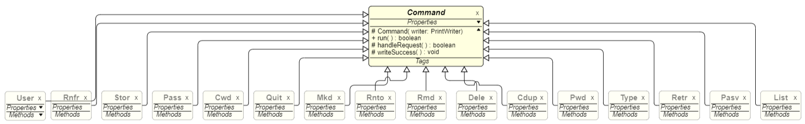
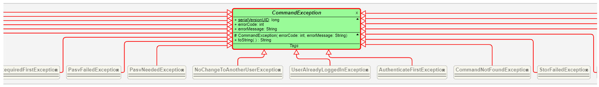

# Serveur FTP
## Auteurs : 
**Plancke** Aurélien aurelien.plancke.etu@univ-lille.fr

**Plé** Lucas M1 E-Services lucas.ple.etu@univ-lille.fr

Ce programme a été réalisé en Java dans le cadre des cours de Système Répartis en Master 1 E-Services.
Il a pour but de se comporter comme un serveur FTP et de gérer les connexions clientes. Ce serveur implémente les commandes de bases ainsi que les connexions concurencielles.

## Installation

### Prérequis pour installer le projet

- [Java 11](https://www.oracle.com/fr/java/technologies/javase/jdk11-archive-downloads.html)
- [Maven](https://maven.apache.org/)

Voici les commandes élémentaires à lancer depuis la racine du projet afin de l'utiliser :

### Compiler le projet 

```
mvn clean compile assembly:single
```

### Lancer les test

```
mvn test
```

### Générer la Javadoc

```
mvn javadoc:javadoc
```

### Accéder à la javadoc 

```
firefox target/site/apidocs/index.html
```

## Fonctionnement de projet

Tout d'abord il faut executer le serveur avec la commande avec

```
java -jar target/FTPServer.jar [port] [root du système de fichier du serveur] [nom_utilisateur:mot_de_passe]
```

Une fois cette commande executée, le serveur est en attente de connexion sur localhost:[port]. Il est possible d'y accéder avec FileZilla ou en CLI. 

Pour passer en mode CLI il faut utiliser un utilitaire comme netcat de la façon suivante : 

```
nc localhost [port]
```

Le fonctionnement est le même que sur un serveur FTP classique, vous retrouverez les commandes implémentées dans la partie [Commandes implémentées](#Commandes-implémentées)

## Architecture du projet

Le projet, developpé en Java implémente de nombreux principes de la programmation objet. 

Afin de gérer facilement les commandes, celles-ci héritent toutes de la classe abstraite `Command`. Cette classe permet de centraliser le comportement commun, tel que l'écriture du résultat d'une commande, ou encore le code de succès. De plus cette classe abstraite implémente au sein de sa fonction `handleRequest`, une exception abstraite de type CommandException. Cette exception abstraite permet d'implémenter pour chaque commande sa propre exception et ses messages/ code d'erreur. Des diagrammes UML de ces parties du serveur sont disponibles plus loin dans ce rapport.

Pour ajouter une commande le processus est donc simple, il suffit d'étendre la classe Command, et d'implémenter le comportement particulier de cette commande dans la méthode héritée `handleRequest`. Comme la classe mère gère grâce à la méthode `run` le fait d'appeler cette méthode ainsi que la méthode `writeSuccess`, le comportement de la commande est la seule chose à implémenter.


## Commandes implémentées

| Commande FTP |                               Effet                                |                      Prends en paramètres                       | Code succes | Code erreur
|:------------:|:------------------------------------------------------------------:|:---------------------------------------------------------------:|:-----------:|:----------:|
|     USER     |                 Commence la procédure de connexion                 |                      Le nom d'utilisateur                       |      331    |     530    |
|     PASS     |                 Permet de vérifier le mot de passe                 |                Le mot de passe de l'utilisateur                 |      230    |     503    |
|     PASV     | Permet de demander une ip et un port pour une connexion de données |               /                                                 |      227    |     421    |
|     CDUP     | Remonte d'un répertoire par rapport à celui courant                |               /                                                 |      250    |     401    |
|     CWD      | Change le répertoire courant                                       |Le chemin vers le répertoire vers lequel se déplacer             |      250    |     401    |
|     DELE     | Supprime un fichier                                                |               Le chemin vers le fichier à supprimer             |      250    |     550    |
|     LIST     | List tout les fichiers du répertoire courant                       |               /                                                 |      226    |     550    |
|     MKD      | Créer un répertoire                                                |              Le chemin vers le répertoire à créér               |      257    |     550    |
|     PWD      | Affiche le repertoire courrant                                     |               /                                                 |      257    |     /      |
|     RETR     | Télécharge un fichier depuis le serveur                            |               Le chemin ou le nom du fichier à télécharger      |      226    |     421    |
|     RMD      | Supprime un répertoire                                             |               Le chemin vers le répertoire à supprimer          |      250    |     550    |
|     RNFR     | Renommes un fichier ou répertoire                                  |               Le nouveau nom                                    |      227    |     421    |
|     STOR     | Téléverse un fichier vers le serveur                               |               Le nom du fichier à téléverser                    |      226    |     421    |
|     TYPE     | Permet d'activer le mode binaire                                   |               /                                                 |      200    |     /      |
|     QUIT     | Arrête la connexion entre le client et le serveur                  | 				/												  |		 221	|	  /

## Code samples

Exemple d'implémentation d'une commande, ici PASV. Comme expliqué dans la partie architecture, la création d'une commande est simple, il suffit d'implémenter la méthode `handleRequest` et son comportement spécifique.

```java
@Override
protected boolean handleRequest() throws CommandException {
	try {
		client.setDataCanal(PassiveModeHandler.enterPassiveMode()); // creer une nouvelle socket du côté serveur
	} catch (IOException e) {
		throw new PasvFailedException();
	}
	ServerSocket socket = client.getDataCanal(); //recupere la socket représentant le canal de données du client
	int port = socket.getLocalPort(); //récupére le port associé au canal de données 
	String[] addressSplit;
	try {
		addressSplit = InetAddress.getLocalHost().getHostAddress().split("\\."); //
	} catch (UnknownHostException e) {
		throw new PasvFailedException();
	}
	String tuple = constructTuple(port, addressSplit); //Utilise le port et l'adresse obtenu pour le formater et le renvoyer au client
	this.successPhrase = "Entering Passive Mode " + tuple; //renvoie l'adresse et le port calculé au client, pour qu'il puisse se connecter
	return true; // La commande s'est bien passée
}
```

Création du serveur, acceptation de la connexion et création du thread client. C'est la base du projet et le point le plus important. Le fait de passer par des threads permet d'avoir un serveur qui accepte plus d'un utilisateur à la fois. Chaque client a sa connexion au serveur et elle est représentée en Java par un objet `Socket`. Cette dernière représente donc une connexion entre le serveur et un client. Il y a autant de `Socket` que de clients connectés sur le serveur.

```java
[...]
ServerSocket server = null;
try {
	server = new ServerSocket(port); //Créer la socket du serveur
} catch (NumberFormatException | IOException e) {
	e.printStackTrace();
}

while (true) { //boucle de fonctionnement du serveur
	System.out.println("Waiting a client ...");
	try {
		Socket socket = server.accept(); // attends une connexion client

		openNewClient(socket, rootPath, syncronizer); // un nouveau client s'est connecté, on lui créer un thread
	} catch (IOException e) {
		e.printStackTrace();
	}
}

public static void openNewClient(Socket socket, Path rootPath, Object syncronizer) {
	ClientThread client = new ClientThread(socket, openClients, rootPath, syncronizer); //créer le thread, avec une référence vers la liste de tout les clients connectés, afin de pouvoir l'enlever quand ce client se déconnecte
	openClients.add(client); //L'ajoute a la liste de tout les client
	client.start(); //Demarre le thread
}
```

La méthode `handleCommand` est la base de l'interaction entre le client et le serveur. En effet, le client interagit avec le serveur uniquement par le biais de commandes bien précises; certaines attendant des paramètres, d'autres non. Cette fonction à pour but d'identifier la commande que le client souhaite exécuter et de lancer cette commande. Si la commande demandée par le client n'est pas reconnue, on renvoie un message d'erreur disant que cette méthode n'est pas implémentée par ce serveur.

```java
public static void handleCommand(String request, PrintWriter writer, ClientThread client) throws CommandException {
	String[] input = new String[2];
	parseInput(request, input);
	String command = input[0].toUpperCase();
	String param = input[1];
	
	Command commandExecutable = null;
	switch(command){
		case CommandConstant.USER :
			throw new NoChangeToAnotherUserException();
		case CommandConstant.PASS :
			throw new UserAlreadyLoggedInException();
		case CommandConstant.PWD :
			commandExecutable = new Pwd(writer, client);
			break;
		case CommandConstant.CWD :
			commandExecutable = new Cwd(writer, client, param);
			break;
		case CommandConstant.PASV :
			commandExecutable = new Pasv(writer, client);
			break;
		case CommandConstant.STOR :
			commandExecutable = new Stor(writer, client, param, client.getSynchronizer());
			break;
		case CommandConstant.RETR :
			commandExecutable = new Retr(writer, client, param, client.getSynchronizer());
			break;
		case CommandConstant.DELE :
			commandExecutable = new Dele(writer, client, param, client.getSynchronizer());
			break;
		case CommandConstant.MKD :
			commandExecutable = new Mkd(writer, client, param, client.getSynchronizer());
			break;
		case CommandConstant.RMD :
			commandExecutable = new Rmd(writer, client, param, client.getSynchronizer());
			break;
		case CommandConstant.LIST:
			commandExecutable = new List(writer, client, client.getSynchronizer());
			break;
		case CommandConstant.TYPE:
			commandExecutable = new Type(writer);
			break;
		case CommandConstant.CDUP:
			commandExecutable = new Cdup(writer, client);
			break;
		case CommandConstant.RNFR:
			commandExecutable = new Rnfr(writer, client, param);
			break;
		case CommandConstant.RNTO:
			commandExecutable = new Rnto(writer, client, param, client.getSynchronizer());
			break;
		case CommandConstant.QUIT:
			commandExecutable = new Quit(writer, client);
			break;
	default:
		throw new CommandNotFoundException();
	}
	if(!commandExecutable.run()) {
		client.interrupt();
	}
}
```

Cet exemple de code montre l'utilisation des blocs `synchronized` dans le serveur. Les `synchronized` sont importants car il peut arriver que deux (ou plus) clients veuillent accéder, modifier ou créer la même ressource, ce qui pourrait provoquer perte de donnée ou incohérence. Ici le `synchronized` permet d'éviter que ce phénoméne se produise en bloquant la ressource pour un seul client le temps que le code contenu dans le bloc s'exécute. Ici, on réalise un `STOR`. On synchronise la vérification de l'existence du fichier, la création de celui-ci s'il n'existe pas et l'écriture sur le disque des données du fichier. Pendant ce temps, les autres clients n'ont pas accès au système de fichiers du serveur et doivent attendre. Ce mécanisme permet de préserver la cohérence du système de fichier du serveur et d'éviter les problèmes de concurrence entre les threads.
 
```java
private void writeFile() throws IOException {
	Socket dataSocket = this.client.getDataCanal().accept();  //
	InputStream stream = dataSocket.getInputStream(); // Recupére le flux de donnée client
	byte[] fileRead = stream.readAllBytes(); //lis le flux de données, représentant le fichier
	String pathFileDelimiter = "";
	if(!this.client.getCurrentPath().toString().endsWith("/")) { //Gestion du path si c'est un dossier ou un fichier
		pathFileDelimiter = "/";
	}

	Path newFilePath = Paths.get(this.client.getCurrentPath().toString() + pathFileDelimiter + this.fileName); //Instancie le nouveau path

	synchronized(this.syncronizer){ // Bloque les autres thread tant qu'un thread est dans cette partie, ici c'est necessaire pour que deux client ne créent pas le même fichier
		if(Files.notExists(newFilePath)) {
			Files.createFile(newFilePath); //Création du fichier
		}
		Files.write(newFilePath, fileRead); //Ecrit dans le fichier
	}// On libère les autres thread
	stream.close(); //On ferme les sockets et stream
	dataSocket.close();
	this.client.getDataCanal().close();
	this.client.setDataCanal(null);
}
```

Récupération des informations sur un fichier durant la commande `LIST`. Ce point est important parce que des utilitaires commme FileZilla s'attendent à un format bien particulier dans la réponse de la commande List, il a donc fallu implémenter une syntaxe bien particulière. Ici, on renvoie les informations des fichiers dans un format semblable à ce que peut produire la commande `ls`. A noter que cette méthode fonctionne si le système qui fait tourner le serveur est un système POSIX.

```java
private String constructFileString(Path path) throws IOException {
	StringBuilder strb = new StringBuilder();
	
	strb.append(Files.isDirectory(path)?"d":"-"); //On vérifie si c'est un répertoire
	strb.append(PosixFilePermissions.toString(Files.getPosixFilePermissions(path))); //On passe par les posix permissions pour avoir les permissions
	strb.append(" ");
	
	strb.append(Files.getAttribute(path, "unix:nlink")); // Nombre de lien symbolique
	strb.append(" ");
	
	strb.append(Files.getOwner(path).getName()); // Propriétaire du fichier
	strb.append(" ");
	
	strb.append(Files.readAttributes(path, PosixFileAttributes.class, LinkOption.NOFOLLOW_LINKS).group()); // Groupe propriétaire du fichier
	strb.append(" ");
	
	strb.append(Files.size(path)); // Taille du fichier
	strb.append(" ");
	
	LocalDateTime modifiedTime = LocalDateTime.ofInstant(Files.getLastModifiedTime(path).toInstant(), ZoneId.systemDefault()); // Dernière modification du fichier
	DateTimeFormatter dtf; 
	if(modifiedTime.getYear() == LocalDateTime.now().getYear()) {
		dtf = DateTimeFormatter.ofPattern("MMM-dd-HH:mm", Locale.ENGLISH); //Si année courante, format MOIS-JOUR-HEURE-MINUTE
	}else {
		dtf = DateTimeFormatter.ofPattern("MMM-dd-yyyy", Locale.ENGLISH); //Sinon MOIS-JOUR-ANNEE
	}
	strb.append(modifiedTime.format(dtf));
	strb.append(" ");
	
	strb.append(path.getFileName()); // Nom du fichier
	strb.append("\n");
	return strb.toString();

}
```

## Diagrammes UML

### Architecture de la partie commandes du serveur


### Architecture de la partie exceptions du serveur


## Vidéo de fonctionnement


